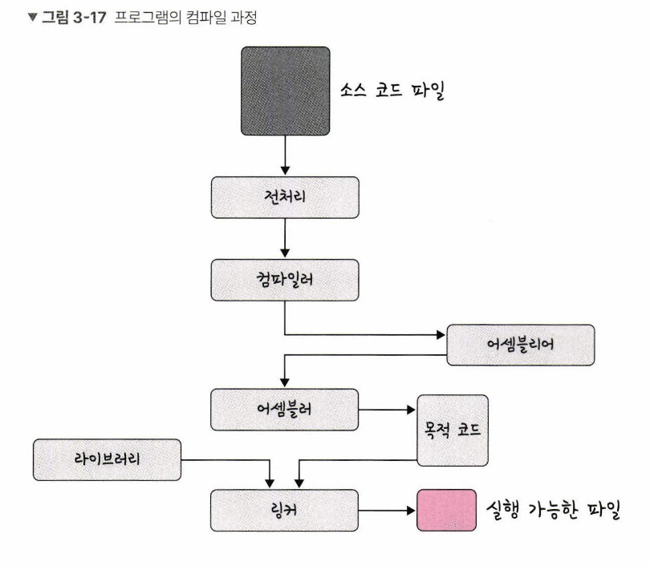

# 프로세스(Process)

컴퓨터에서 실행되고 있는 프로그램 

CPU의 스케쥴링의 대상이 되는 작업(Task)

## 프로세스의 컴파일 과정

프로세스는 프로그램으로부터 인스턴스화 된 것을 말한다.

> 예)  
> 프로그램 : 크롬 프로그램(chrome.exe)
> 프로세스 : 크롬을 실행 - 프로세스가 실행

컴파일러가 컴파일 과정을 마치고 컴퓨터가 이해할 수 있는 기계어로 번역되어 실행될 수 있는 파일이 되는 것

|과정|설명|
|---|---|
|전처리|소스 코드의 주석을 제거하고 #include등 헤더 파일을 병합하여 매크로를 치환|
|컴파일러|오류 처리, 코드 최적화 작업을 하며 어셈블리어로 변환|
|어셈블러|어셈블리어는 목적 코드(object code)로 변환|
|링커|프로그램 내에 있는 라이브러리 함수 또는 다른 파일과의 목적 코드를 결합하여 실행 파일을 생성(.exe 또는 .out과 같은 확장자를 가짐)|

---
## 정적 라이브러리와 동적 라이브러리

|종류|방식|단점|
|---|---|---|
|정적 라이브러리|프로그램 빌드 시 라이브러리가 제공하는 모든코드를 실행 파일에 넣는 방식|시스템 환경 등 의존도가 낮고 코드 중복 등 메모리 효율성이 떨어짐|
|동적 라이브러리|프로그램 실행 시 필요할 때만 DLL이라는 함수 정보를 통해 참조하는 방식|메모리 효율성에서의 장점과 외부 의존도가 높아지는 단점이 있음|
