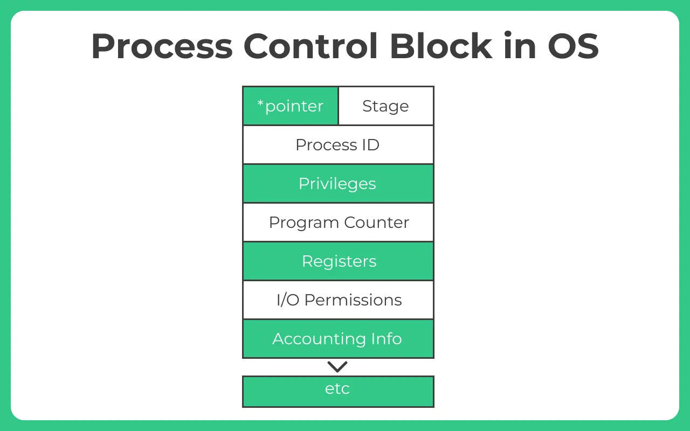
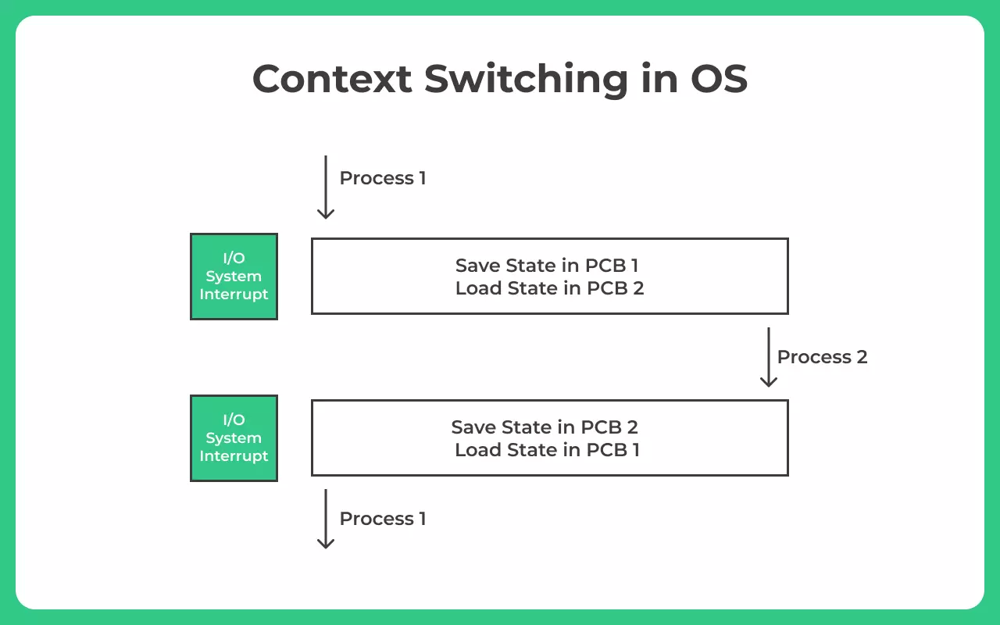

# 프로세스(Process)

컴퓨터에서 실행되고 있는 프로그램 

CPU의 스케쥴링의 대상이 되는 작업(Task)

## 프로세스의 컴파일 과정

프로세스는 프로그램으로부터 인스턴스화 된 것을 말한다.

> 예)  
> 프로그램 : 크롬 프로그램(chrome.exe)
> 프로세스 : 크롬을 실행 - 프로세스가 실행

컴파일러가 컴파일 과정을 마치고 컴퓨터가 이해할 수 있는 기계어로 번역되어 실행될 수 있는 파일이 되는 것

| 과정     | 설명                                                                                                                             |
| -------- | -------------------------------------------------------------------------------------------------------------------------------- |
| 전처리   | 소스 코드의 주석을 제거하고 #include등 헤더 파일을 병합하여 매크로를 치환                                                        |
| 컴파일러 | 오류 처리, 코드 최적화 작업을 하며 어셈블리어로 변환                                                                             |
| 어셈블러 | 어셈블리어는 목적 코드(object code)로 변환                                                                                       |
| 링커     | 프로그램 내에 있는 라이브러리 함수 또는 다른 파일과의 목적 코드를 결합하여 실행 파일을 생성(.exe 또는 .out과 같은 확장자를 가짐) |

---

## 정적 라이브러리와 동적 라이브러리

| 종류            | 방식                                                                    | 단점                                                             |
| --------------- | ----------------------------------------------------------------------- | ---------------------------------------------------------------- |
| 정적 라이브러리 | 프로그램 빌드 시 라이브러리가 제공하는 모든코드를 실행 파일에 넣는 방식 | 시스템 환경 등 의존도가 낮고 코드 중복 등 메모리 효율성이 떨어짐 |
| 동적 라이브러리 | 프로그램 실행 시 필요할 때만 DLL이라는 함수 정보를 통해 참조하는 방식   | 메모리 효율성에서의 장점과 외부 의존도가 높아지는 단점이 있음    |

## 프로세서의 상태

- 생성(create)

  - 프로세스가 생성된 상태
  - `fork()`, `exec()`함수를 통해 생성
  - PCB가 할당됨.

- 대기 상태(ready)

  - 메모리 공간이 충분하면 메모리를 할당받고 아니면 아닌 상태로 대기하고 있으며 CPU 스케쥴러로부터 CPU 소유권이 넘어오기를 기다리는 상태

- 대기 중단 상태(ready suspended), 보류 대기

- 실행 상태(running)

  - CPU 소유권과 메모리를 할당받고 인스트럭션을 수행 중인 상태를 의미함.
  - CPU burst가 일어났다고 표현함.

- 중단 상태(blocked)

  - 이벤트가 발생한 이후 기다리며 프로세스가 차단된 상태
  - I/O 디바이스에 의한 인터럽트로 이런 현상이 많이 발생함.

- 일시 중단 상태(blocked suspended), 보류 준비

  - 대기 중단과 유사함.
  - 중단된 상태에서 프로세스가 실행되려고 했지만 메모리 부족으로 일시 중단된 상태

- 종료 상태(terminated)

  - 메모리와 CPU 소유권을 모두 놓고 가는 상태
  - 자연스럽게 종료되기도 하지만, 부모 프로세스가 자식 프로세스를 강제시키는 비자발적 종료
    (abort)가 있음.
  - 자식 프로세스에 할당된 자원의 한계치를 넘어서거나 부모 프로세스가 종료되거나 사용자가 `process, kill`등 여러 명령어로 프로세스를 종료할 떄 발생

  ## 프로세스의 메모리 구조

- 스택

  - 컴파일 시, 크기가 결정됨.
  - 동적
  - 함수가 함수를 재귀적으로 호출하면서 동적으로 크기가 늘어날 수 있는데, 이 떄 힙과 스택의 메모리 영역이 겹치면 안 되기 때문에 힙과 스택 사이의 공간을 비워놓음.

- 힙

  - 동적 할당할 때 사용
  - 동적
  - 런타임 시 크기가 결정됨.

- 데이터 영역

  - 정적인 특징을 가지는 프로그램이 종료되면 사라지는 변수가 들어있는 영역
  - BSS영역과 Data영역으로 나뉨.
  - BSS영역은 초기화되지 않은 변수가 0으로 초기화되어 저장됨.
  - Data영역은 0이 아닌 다른 값으로 할당된 변수들이 저장됨.

- 코드 영역
  - 프로그램에 내장되어 있는 소스 코드가 들어가는 영역
  - 정적
  - 수정 불가능한 기계어로 저장되어 있음.

---

## PCB(Process Control Block)

운영체제에서 프로세스에 대한 메타데이터를 저장한 `데이터`를 말함.

프로세스 제어 블록이라고도 함.

> 프로세스가 생성되면 운영체제는 해당 PCB를 생성함.

프로그램이 실행되면, 프로세스가 생성되고 프로세스 주소 값들이 메모리에 할당되며, 프로세스의 메타 데이터들이 PCB에 저장되어 관리됨.
프로세스의 중요한 정보를 포함하고 있기 때문에, 일반 사용자가 접근할 수 없도록 커널 스택 가장 앞부분에서 관리됨.

### PCB의 구조

---

## 컨텍스트 스위치(Context Switching)

> `프로세스 A`가 운영체제로부터 CPU를 할당받아 실행되다가 시간이 다 되어 `프로세스 B`에 CPU사용을 양보하였을 때, 직전까지 실행되던 `프로세스 A`의 정보(레지스터 값, 메모리 정보, 파일, 입출력 장치등)를 백업해야 함. 
> 이러한 중간 정보들을 `문맥(Context)`라고 함.

기존 프로세스의 문맥을 PCB에 백업하고, 새로운 프로세스를 실행하기 위해 문맥을 PCB로부터 복구하여 새로운 프로세스를 실행하는 것을 `문맥 교환(context switching)`이라고 함.

문맥교환이 자주 일어나면 프로세스는 그만큼 빨리 번갈아 가며 수행함에 따라, 프로세스들이 동시에 실행되는 것처럼 보인다. 하지만, 너무 자주 하면 `오버헤드`[1](#footnote_1)가 발생할 수 있기 때문에 자주 일어나는것이 좋은 것만은 아니다.

<a name="footnote_1">오버헤드</a> : 오버헤드란 프로그램의 실행흐름에서 나타나는 현상중 하나로 예를 들어 , 프로그램의 실행흐름 도중에 동떨어진 위치의 코드를 실행시켜야 할 때 , 추가적으로 시간,메모리,자원이 사용되는 현상
