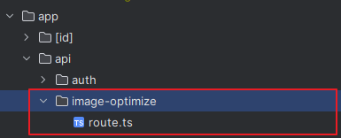

# Next API Route를 이용하여 이미지 최적화(feat.Sharp)

이미지 업로드 시, 웹 페이지의 최적화를 위해서 이미지의 크기를 조정할 필요가 있었다.
이 필요성에 따라 이미지 업로드 시 Sharp를 이용하여 이미지를 최적화 하게 되었다.

## 도입 이유

서비스의 백엔드가 Spring을 이용하여 개발되었는데, 이미지의 최적화의 경우 Java를 이용하는 것보다 Node를 이용하는 것이 좋다는 의견이 있어 NextJS API Route를 이용하여 이미지 최적화를 진행하고 업로드를 하기로 하였다.

## Sharp

Sharp는 NodeJs환경에서 이미지의 리사이징 및 이미지 변환을 처리하는 라이브러리이다.

[Sharp](https://www.npmjs.com/package/sharp)


## API Route

API Route란 NextJs에서 제공하는 기능으로, NextJS에서 정의한 경로에 접속하게 되면 Server-Side Endpoint가 된다.

[NextJs App Routing - Routing File Convention](https://nextjs.org/docs/app/building-your-application/routing)

우선 API를 만들기 위해, 폴더경로를 다음과 같이 위치시켰다.



그리고 API의 요청과 관련한 코드를 작성하였다.

NodeJs에서는 File객체로 반환할 수 없어, Buffer를 이용하여 반환해주었다.

### Buffer

### Unit8Array

### BLob이란

### 트러블 슈팅

Buffer로 온 데이터를 어떻게 File객체로 변환하는지가 어려웠다.
이 과정에서 알게 된 것이 Uint8Array이다.

### Pormise.all의 사용 이유


```typescript
const processFiles = async (formData: FormData): Promise<File[]> => {
    const imageOptimizeData = await ky.post('/api/image-optimize', {
      body : formData
    }).json()

    const result = await imageOptimizeData
    return await Promise.all(
      result.data.files.map(async (bufferFile: ImageOptimizeData) => {
        const bufferArray = bufferFile.buffer.data
        const blob = new Blob([new Uint8Array(bufferArray)])

        return new File([blob], `${bufferFile.name}.jpeg`, { type: 'image/jpeg' })
      })
    )
  }
```

```typescript
// API
import {NextRequest, NextResponse} from "next/server";
import sharp from "sharp";

export async function POST(request : NextRequest, response : NextResponse) {
  const formData = await request.formData()

  const files = formData.getAll('file') as File[]

  if (files.length < 1) {
    return NextResponse.json({ error: 'No files received.' }, { status: 400 })
  }

  const processedFiles = await Promise.all(
    files.map(async (file, index) => {
      const buffer = await file.arrayBuffer()
      const processedBuffer = await sharp(Buffer.from(buffer))
        .resize(
          600,
          600,
          { fit: 'contain' }
        )
        .toBuffer()

      return { name: `upload_file_${index}`, status: 'processed', buffer: processedBuffer }
    }),
  )

  return NextResponse.json({
    status: 'success',
    data : {
      files: processedFiles
    },
    message: '파일 변환 성공',
  })
}
```