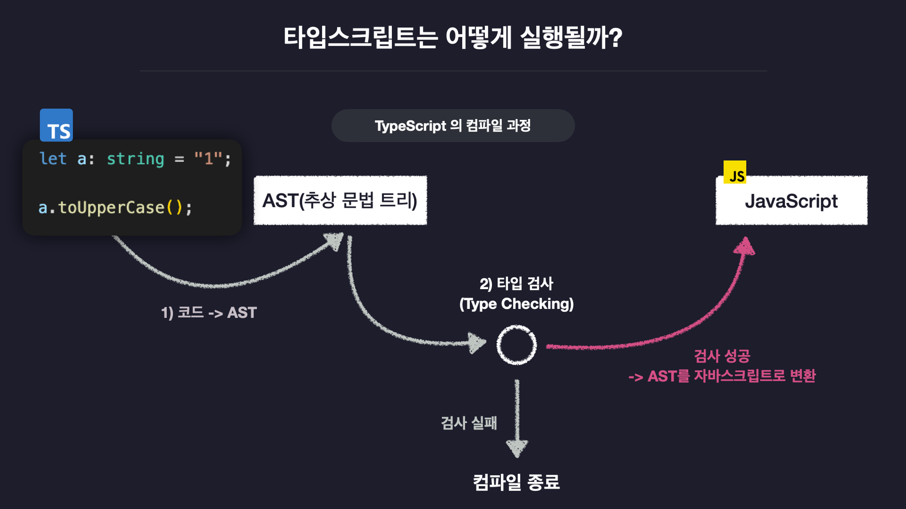

# 타입스크립트

자바스크립트의 확장판

> 자스크립트를 더 안전하게 사용할 수 있도록 `타입 관련 기능들을 추가한` 언어

- 자바 스크립트는 동적 타입 시스템을 가지고 있음.

## 타입 스크립트 타입 시스템

> 동적 타입 시스템 + 정적 타입 시스템

- 동적 타입 시스템

  - 변수의 타입을 실행 전에 결정
  - 타입오류를 실행 전에 검사함

- 정적 타입 시스템

### 점진적 타입 시스템(Gradual Type System)

타입스크립트에서는 변수의 타입을 직접 정의하지 않아도, 변수에 담기는 초깃값의 타입을 추론함

## 타입스크립트의 동작 원리

---

[한 입 크기로 잘라먹는 타입스크립트](https://ts.winterlood.com/6c9bf87f-6a8f-4e96-95b4-5e12d9f82165)
