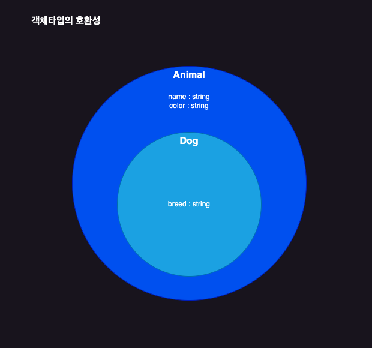

# 객체타입간의 호환성

> 어떤 객체타입을 다른 객체 타입으로 취급할 수 있는가?

```typescript
type Animal = {
  name: string;
  color: string;
};

type Dog = {
  name: string;
  color: string;
  bread: string;
};

let animal: Anmial = {
  name: "기린",
  color: "yellow",
};

let dog: Dog = {
  name: "돌돌이",
  color: "brown",
  breed: "진도",
};

animal = dog;

// 타입 에러 발생
dog = animal;
```



- Animal 타입은 name과 color 프로퍼티를 갖는 모든 객체들을 포함하는 집합
- Dog 타입은 name과 color 거기에다 추가로 breed 프로퍼티를 갖는 모든 객체를 포함하는 집합

어떤 객체가 Dog 타입에 포함된다면 무조건 Animal 타입에도 포함된다.
하지만 Animal 타입에 포함되는 모든 객체가 Dog 타입에 포함되는것은 아니므로, Animal은 Dog의 슈퍼타입이다.

```typescript
type Book = {
  name: string;
  price: number;
};

type ProgrammingBook = {
  name: string;
  price: number;
  skill: string;
};

let book: Book;

let programmingBook: ProgrammingBook = {
  name: "프로그래밍 책",
  price: 33000,
  skill: "reactjs",
};

book = programmingBook;

// 다운 캐스팅(불가)
programmingBook = book;
```

## 초과 타입 검사

```typescript
type Book = {
  name: string;
  price: number;
};

let book2: Book = {
  name: "책",
  price: 33000,
  skill: "react",
};
```

변수를 초기화할 때, 초기화하는 값으로 `객체 리터럴을 사용`하면 발동되는 검사

객체 타입 변수를 초기화할 때, 타입에는 정의해 놓지 않은 프로퍼티를 작성하면 안되도록 막는 검사

```typescript
let book3: Book = programmingBook;
```

> 이렇게 하였을 땐, 객체 리터럴이 아님에 따라 가능함.

```typescript
function func(book: Book) {}

func({
  name: "책",
  price: 33000,
  skill: "react", // 타입 에러 발생
});
```

> 함수의 인자를 넣었을 때에도 초과 타입 검사가 실행됨.
