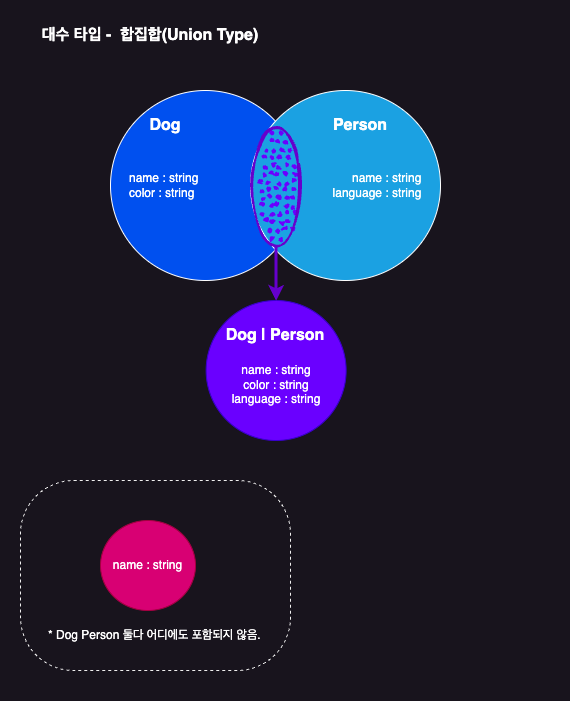
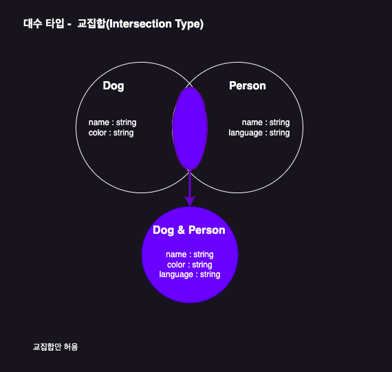

# 대수 타입

여러개의 타입을 합성해서 새롭게 만들어낸 타입

## 합집합 타입(Union Type)



```typescript
let a: string | number | boolean;
a = 1;
a = "hello";

a = true;

let arr: (number | string | boolean)[] = [1, "hello", true];

type Dog = {
  name: string;
  color: string;
};

type Person = {
  name: string;
  language: string;
};

type Union1 = Dog | Person;

let union1: Union1 = {
  name: "",
  color: "",
};

let union2: Union1 = {
  name: "",
  language: "",
};

let union3: Union1 = {
  name: "",
  color: "",
  language: "",
};

// 타입 오류 발생
let union4: Union1 = {
  name: "",
};
```

## 교집합 타입(Intersection Type)



```typescript
let variable: number & string;
// never타입이 됨
```

> 기본 타입을 가지고 Intersection Type을 선언하면, 대부분 never타입이 된다.<br/>
> 왜냐하면 기본 타입들 중에는 서로 공유하거나 겹치는 값들이 없기 때문이다.

```typescript
type Dog = {
  name: string;
  color: string;
};

type Person = {
  name: string;
  language: string;
};

type Intersection = Dog & Person;

let intersection1: Intersection = {
  name: "",
  color: string,
  language: string,
};
```
