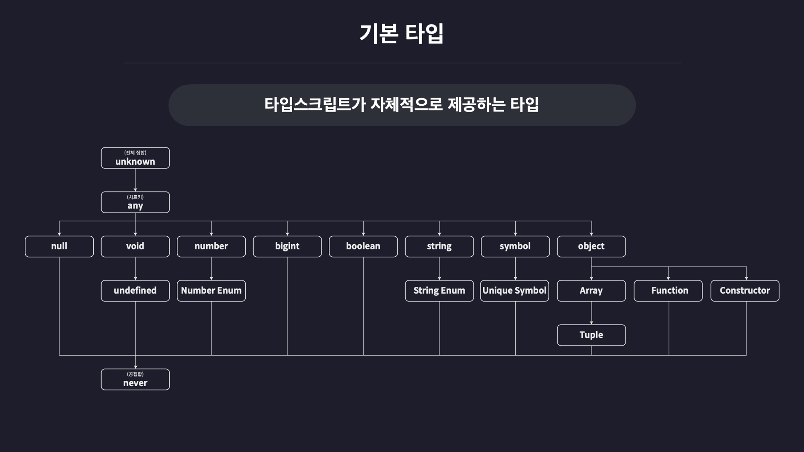

# 타입스크립트의 기본 타입



## 원시 타입(Primitive Type)

원시타입은 불변성을 가지고 있기 때문에, 기존에 메모리에 생성된 값들은 그 자체가 변경될 수 없다.


### number 타입

```typescript
let num1: number = 123;
let num2: number = -123;
let num3: number = 0.123;
let num4: number = -0.123;
let num5: number = Infinity;
let num6: number = -Infinity;
let num7: number = NaN;
```

`:type`부분을 `타입 주석` 또는 `타입 어노테이션(Type Annotaion)`이라고 함.

> 정해진 타입 주석외에는 할당할 수 없으며, 타입이 사용할 수 없는 메서드는 사용할 수 없음.

### string 타입

```typescript
let str1: string = "hello";
let str2: string = 'hello';
let str3: string = `hello`;
let str4: string = `hello ${str1}`;
```

단순 쌍따옴표 문자열 뿐만 아니라 작은 따옴표, 백틱, 템플릿 리터럴로 만든 모든 문자열을 포함

### boolean 타입

```typescript
let bool1: boolean = true;
let bool2: boolean = false;
```

### null 타입

```typescript
let null: null = null;
```

잠깐 null을 넣어야 할때 `컴파일러 옵션`을 변경하여, null을 임시로 넣을 수 있다.

```json

...
"compilerOptions": {
    ...
    // "strictNullChecks": true, 
		...
  },
...

```

엄격하게 null을 체크하는 것을 해제하여 임시로 null을 넣을 수 있도록 한다.

### undefined 타입

```typescript
let unde: undefined = undefined;
```


---

### 리터럴 타입

타입스크립트는 `타입 뿐만 아니라 딱 하나의 값만 포함하는 타입`도 존재함.

> 값 자체가 타입이 되는 것

```typescript
let numA : 10 = 10

let strA : 'hello' = 'hello'
```
